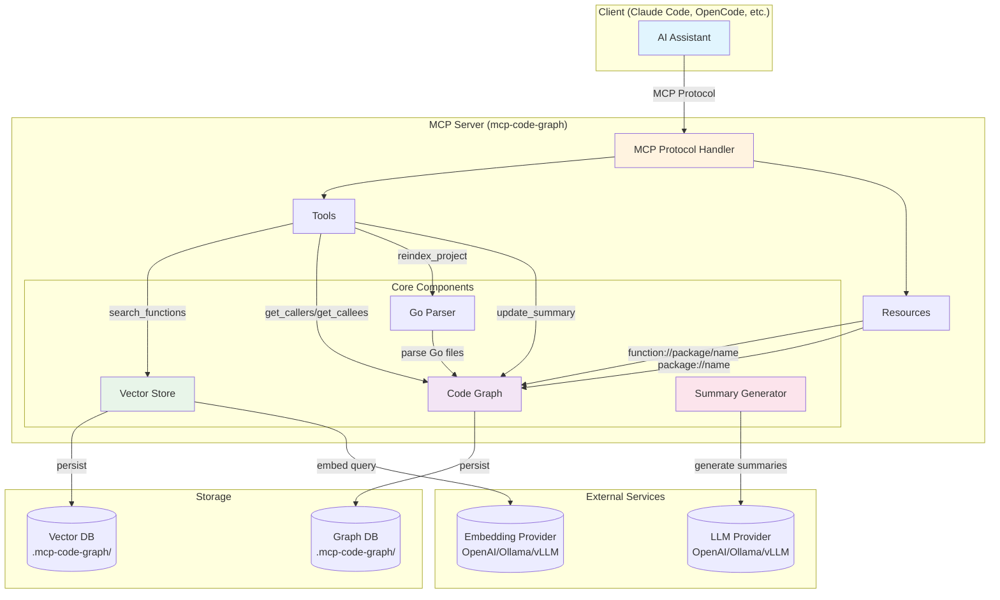

# MCP Code Graph

An MCP (Model Context Protocol) server that provides a code graph database for AI assistants to understand Go codebases through function summaries, call graphs, and semantic search.

## Features

- **Code Graph**: Functions, types, packages, and their relationships
- **Call Graph**: Find callers and callees for any function
- **Semantic Search**: Search functions by purpose using vector embeddings
- **LLM Summaries**: Auto-generated function summaries with human-editable overrides
- **Incremental Indexing**: File watcher + manual full reindex

## Installation

```bash
go install github.com/thomassaison/mcp-code-graph/cmd/mcp-code-graph@latest
```

Or run directly without installing:

```bash
go run github.com/thomassaison/mcp-code-graph/cmd/mcp-code-graph@latest
```

## Usage

### Run in Your Project

```bash
cd /path/to/your/go/project
go run github.com/thomassaison/mcp-code-graph/cmd/mcp-code-graph@latest
```

Or if installed:

```bash
mcp-code-graph
```

The server automatically:
- Detects the project from the current working directory
- Creates `.mcp-code-graph/` in the project root for the database

### Command Line Options

None. All configuration is via environment variables.

### Environment Variables

- `MCP_CODE_GRAPH_DIR` - Override database directory (default: `<project>/.mcp-code-graph`)
- `EMBEDDING_CONFIG` - JSON config for semantic search embeddings (see below)
- `LLM_CONFIG` - JSON config for function summaries (see below)

## Architecture



**Data Flow:**
1. **Indexing**: Go Parser extracts functions/types → Code Graph stores relationships → persisted to Graph DB
2. **Semantic Search**: Query → Vector Store → Embedding Provider → similarity match → function results
3. **Summaries**: Summary Generator → LLM Provider → function summaries (on-demand)

### Semantic Search Configuration

Configure embedding provider for semantic search via `EMBEDDING_CONFIG`:

**OpenAI:**
```bash
export EMBEDDING_CONFIG='{"provider":"openai","api_key":"sk-...","model":"text-embedding-3-small"}'
```

**Ollama (local):**
```bash
export EMBEDDING_CONFIG='{"provider":"openai","base_url":"http://localhost:11434/v1","model":"nomic-embed-text"}'
```

**vLLM / other OpenAI-compatible:**
```bash
export EMBEDDING_CONFIG='{"provider":"openai","base_url":"http://localhost:8000/v1","model":"your-model","api_key":"optional"}'
```

Without `EMBEDDING_CONFIG`, search falls back to name matching only.

### LLM Configuration

Configure LLM provider for function summaries via `LLM_CONFIG`:

**OpenAI:**
```bash
export LLM_CONFIG='{"provider":"openai","api_key":"sk-...","model":"gpt-4o-mini"}'
```

**Ollama (local):**
```bash
export LLM_CONFIG='{"provider":"openai","base_url":"http://localhost:11434/v1","model":"llama3.2"}'
```

**vLLM / other OpenAI-compatible:**
```bash
export LLM_CONFIG='{"provider":"openai","base_url":"http://localhost:8000/v1","model":"your-model","api_key":"optional"}'
```

Without `LLM_CONFIG`, summaries use a mock provider that returns placeholder text.

## Client Integration

### OpenCode

Add to `~/.config/opencode/opencode.json`:

```json
{
  "mcp": {
    "mcp-code-graph": {
      "type": "local",
      "command": ["go", "run", "github.com/thomassaison/mcp-code-graph/cmd/mcp-code-graph@latest"],
      "enabled": true
    }
  }
}
```

With semantic search and summaries (Ollama):

```json
{
  "mcp": {
    "mcp-code-graph": {
      "type": "local",
      "command": ["go", "run", "github.com/thomassaison/mcp-code-graph/cmd/mcp-code-graph@latest"],
      "enabled": true,
      "environment": {
        "EMBEDDING_CONFIG": "{\"provider\":\"openai\",\"base_url\":\"http://localhost:11434/v1\",\"model\":\"nomic-embed-text\"}",
        "LLM_CONFIG": "{\"provider\":\"openai\",\"base_url\":\"http://localhost:11434/v1\",\"model\":\"llama3.2\"}"
      }
    }
  }
}
```

### Claude Code

Add to your project's `.claude/settings.json` or `~/.claude/settings.json`:

```json
{
  "mcpServers": {
    "mcp-code-graph": {
      "command": "go",
      "args": ["run", "github.com/thomassaison/mcp-code-graph/cmd/mcp-code-graph@latest"]
    }
  }
}
```

With semantic search and summaries:

```json
{
  "mcpServers": {
    "mcp-code-graph": {
      "command": "go",
      "args": ["run", "github.com/thomassaison/mcp-code-graph/cmd/mcp-code-graph@latest"],
      "env": {
        "EMBEDDING_CONFIG": "{\"provider\":\"openai\",\"api_key\":\"sk-...\",\"model\":\"text-embedding-3-small\"}",
        "LLM_CONFIG": "{\"provider\":\"openai\",\"api_key\":\"sk-...\",\"model\":\"gpt-4o-mini\"}"
      }
    }
  }
}
```

### Claude Desktop

Add to your Claude Desktop config:

**macOS**: `~/Library/Application Support/Claude/claude_desktop_config.json`  
**Windows**: `%APPDATA%\Claude\claude_desktop_config.json`

```json
{
  "mcpServers": {
    "mcp-code-graph": {
      "command": "go",
      "args": ["run", "github.com/thomassaison/mcp-code-graph/cmd/mcp-code-graph@latest"]
    }
  }
}
```

> **Note**: All clients automatically set the working directory to your project root, so no `--project` flag is needed.

### Git Ignore

Add to your project's `.gitignore`:

```
.mcp-code-graph/
```

## MCP Tools

| Tool | Description |
|------|-------------|
| `search_functions` | Search for functions by name or semantic similarity |
| `get_callers` | Get all functions that call this function |
| `get_callees` | Get all functions called by this function |
| `reindex_project` | Trigger full reindex |
| `update_summary` | Update a function's summary |
| `get_function_by_name` | Find functions by exact name |
| `get_implementors` | Find all types that implement an interface |
| `get_interfaces` | Find all interfaces a type implements |

## MCP Resources

- `function://{package}/{name}` - Function details
- `package://{name}` - Package overview

## OpenCode Skill

This project includes a skill for OpenCode that teaches the AI agent how to use the MCP tools for code understanding.

**Install the skill:**

```bash
# Copy to your OpenCode skills directory
cp -r skills/mcp-code-graph ~/.config/opencode/skills/
```

**Or link it:**

```bash
ln -s $(pwd)/skills/mcp-code-graph ~/.config/opencode/skills/mcp-code-graph
```

The skill instructs the agent to:
- Prefer MCP tools (`search_functions`, `get_callers`, `get_callees`) over grep for code understanding
- Use semantic search for "find functions that..." queries
- Trace call chains with callers/callees tools
- Follow workflows for understanding functions and answering "how does X work?" questions

## Debug Mode

Set `MCP_CODE_GRAPH_DEBUG` to enable verbose logging to stderr:

| Value | Effect |
|-------|--------|
| `0` | Off (default) |
| `1` | Basic — indexing, search path, embedding, LLM calls |
| `2` | Verbose — per-file parsing, edge resolution, individual scores |

Optionally write logs to a file (appended) with `MCP_CODE_GRAPH_DEBUG_FILE`:

```json
{
  "env": {
    "MCP_CODE_GRAPH_DEBUG": "1",
    "MCP_CODE_GRAPH_DEBUG_FILE": "/tmp/mcp-code-graph-debug.log"
  }
}
```

## Configuration

See [ADR-0007](adr/0007-project-structure.md) for architecture details.

## Development

```bash
make build    # Build binary (version from git tags)
make test     # Run tests with race detector
make install  # Install to $GOBIN
make lint     # Run golangci-lint
make run      # Run locally
```

## License

MIT
