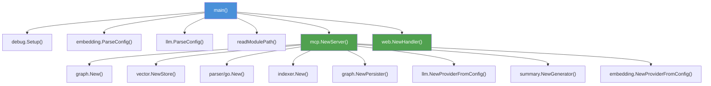

# Main Function Call Graph

```mermaid
flowchart TB
    main["main()"]
    
    debug_setup["debug.Setup()"]
    embedding_parse["embedding.ParseConfig()"]
    llm_parse["llm.ParseConfig()"]
    read_module["readModulePath()"]
    
    mcp_server["mcp.NewServer()"]
    web_handler["web.NewHandler()"]
    
    graph_new["graph.New()"]
    vector_store["vector.NewStore()"]
    parser_go["parser/go.New()"]
    indexer_new["indexer.New()"]
    graph_persist["graph.NewPersister()"]
    llm_provider["llm.NewProviderFromConfig()"]
    summary_gen["summary.NewGenerator()"]
    embedding_provider["embedding.NewProviderFromConfig()"]
    
    main --> debug_setup
    main --> embedding_parse
    main --> llm_parse
    main --> read_module
    main --> mcp_server
    main --> web_handler
    
    mcp_server --> graph_new
    mcp_server --> vector_store
    mcp_server --> parser_go
    mcp_server --> indexer_new
    mcp_server --> graph_persist
    mcp_server --> llm_provider
    mcp_server --> summary_gen
    mcp_server --> embedding_provider
    
    style main fill:#4a90d9,color:#fff
    style mcp_server fill:#50a14f,color:#fff
    style web_handler fill:#50a14f,color:#fff
```

**Diagram Key:**
- Blue: Entry point (`main`)
- Green: Major components (`NewServer`, `NewHandler`)
- Default: Helper/initialization functions
